# MCP Matrix + Brand Deliverable Generation Specification

**Status:** P0 and R1 merged with green staging CI; M0 implemented and pending PR/CI
**Date:** 2026-07-13
**Target:** `staging`, one PR per phase
**Primary contexts:** `content-pipeline`, `brand-engine`
**Secondary contexts:** `platform-foundation`, `analytics-intelligence`,
`inbox`, `client-portal`

## 1. Goal and success definition

Create one MCP-driven manufacturing path in which:

1. a typed brand-intake revision and authentic samples produce a provisional
   voice foundation;
2. the workflow pauses while that foundation is reviewed and explicitly
   finalized as the downstream voice authority;
3. only the frozen finalized voice may drive the dependent, grounded brand
   suite;
4. approved brand context and an explicit matrix cell produce a locked,
   grounded, audited page draft;
5. the same contracts scale from one cell to a bounded service/location set;
   and
6. explicit human approval can advance a clean draft to `ready_to_publish`
   without automatically publishing it.

Success is not “the model returned text.” Success means the source, template,
voice, evidence, artifact, audit, review state, and AI run can all be traced;
missing facts remain visible; newer human work wins; automatic generation stops
at `ready_for_human_review`; and no workflow claims approval, send, publication,
or `ready_to_publish` without the existing explicit human action.

## 2. Personas and trust requirements

| Persona | Job | Anxiety | What would destroy trust |
|---|---|---|---|
| Agency operator | Produce a coherent page set without page-by-page orchestration | Hidden failures, runaway cost, mixed voice | “Complete” with missing pages, overwritten edits, or no retry path |
| Multi-location operator | Cover the intended service/location grid exactly once | Duplicate URLs, cannibalization, thin doorway copy | Treating a city label as proof of an office or local experience |
| Brand strategist | Turn intake into an editable, consistent brand system | Generic prose and invented positioning | AI claims presented as client facts or a voice “lock” with no evidence |
| Skeptical client | Review what will represent the business | Unseen drafts and false agency claims | Auto-send/publish, leaked internal evidence, or fabricated credentials |
| MCP agent | Discover, preview, start, poll, and recover deterministically | Ambiguous IDs and giant untyped results | Keyword-based selection, unstable errors, or duplicate paid starts |

## 3. Scope

### In scope

- durable, typed brand-intake revisions and compatibility projection;
- explicit matrix/template/cell preflight and MCP read tools;
- single-cell brief + post generation with locked lineage;
- deterministic and structured persona/voice/SEO/AEO/CTA audit;
- one bounded automatic revision and honest unresolved findings;
- durable matrix and brand run/item ledgers;
- bounded batch orchestration, cancellation, resume, failed-item retry, cost
  preview, hard quota, and resource-scoped idempotency;
- brand-suite presets including voice, positioning/messaging, tagline/values,
  audience, and a new `naming` creative-proposal type;
- real voice finalization with anchor evidence;
- grouped brand review through the unified Inbox with per-item decisions;
- approved client-safe brand summary and page-type brand-context allow-list;
- a final durable intake→brand→content orchestration that pauses at reviews.

### Out of scope

- automatic Webflow publication, client send, source approval, or production
  feature-flag changes;
- trademark/domain/legal clearance for generated names;
- treating generated copy as verified business evidence;
- injecting all brand deliverables into every content/recommendation prompt;
- a second matrix generator built on the current copy-batch service;
- destructive migrations or normalization of the existing matrix cell blob in
  the first delivery program;
- direct production release or `staging`→`main` promotion.

## 4. End-to-end authority flow

```mermaid
flowchart LR
  I["Typed intake revision"] --> V["Provisional voice foundation"]
  E["Authentic evidence and samples"] --> V
  V --> R0["Voice foundation review"]
  R0 -->|"operator selects anchors + finalizes"| A["Frozen finalized voice"]
  A --> B["Dependent identity + messaging run"]
  B --> A2["Approved identity snapshot"]
  M["Matrix + template + explicit cell"] --> P["Deterministic preflight"]
  A --> P
  A2 --> P
  P --> G["Brief + page draft"]
  G --> Q["Deterministic + AI audit"]
  Q -->|"one bounded revision"| G
  Q --> R["Ready for human review"]
  R --> H["Explicit review + approval"]
  H --> X["Ready to publish"]
  X --> Y["Separate existing publish action"]
```



Authority order is: verified source evidence → accepted intake/discovery →
approved brand identity and finalized voice → matrix targeting/template →
generated proposal. A lower layer may not rewrite a higher layer as fact.

## 5. MCP/API surface

All new action inputs use snake_case, stable error codes, declared workspace
scope, expected revisions, and idempotency keys. The one exception is pSEO
matrix materialization: its durable `(workspace, blueprint entry)` singleton
link plus exact matrix-definition fingerprint is the resource-scoped idempotency
authority, so a redundant caller key is not stored. List/detail output is bounded.
The canonical runtime registry is the sole authority for discovery, dispatch,
schema census, and workspace authorization. Authenticated MCP key ID/label and
request/tool identity are retained for internal activity and durable run
attribution, but key identity is excluded from workspace broadcasts and every
client-visible activity projection. Public matrix-run DTOs also omit the
idempotency key and full MCP execution context; MCP/system creators project to
actor type only, while operator/client IDs and optional labels remain available
for human review history.
Definitions are immutable registry snapshots, every production definition is
censused against its exact family handler and any pre-dispatch handled-name
manifest, and error compatibility is selected per tool. Caller correlation is
not trusted: the server-generated UUID is used for HTTP logging, response
attachment, and durable attribution, while every caller `X-Request-ID` is
ignored. Rejection logging also excludes raw unknown tool/workspace values.
Future `json_v1`
tools cannot return an unsanitized handler error: invalid
or thrown failures become bounded generic envelopes while the existing 61
registered handlers retain legacy text behavior. Registry-owned unknown/auth
rejections are intentionally generic and never reflect caller values.

### Matrix tools

| Tool | Purpose |
|---|---|
| `list_content_matrices` | Cursor-paged matrix summaries ordered by updated time + ID; optional template filter (there is no matrix-level status) |
| `get_content_matrix` | Matrix metadata plus cursor-paged cells; no giant blob response |
| `resolve_content_matrix_cells` | Structural-only IDs/revisions/template/URL/block-manifest resolution; no voice, paid estimate, or AI |
| `accept_content_template_generation_upgrade` | Version-conditionally accept the exact deterministic legacy-template upgrade proposal; never infers ambiguous roles |
| `preview_content_matrix_generation` | Resolve explicit cells, blockers, revisions, fingerprint, and cost/call estimate without paid work |
| `start_content_matrix_generation` | Start one or many previewed cells; return job/run IDs and whether an idempotent run already existed |
| `get_content_matrix_generation` | Summary plus cursor-paged item states/audit outcomes |
| `retry_content_matrix_generation` | Retry only failed/blocked-authorized items against explicit current revisions |
| `resolve_content_matrix_evidence` | Attach a typed value + durable source ref to one cell requirement with the full expected source revision; works before a run exists, invalidates preview, and never starts paid work |
| `get_pseo_matrix_plan` | Read one collection blueprint entry, linked template variables, and exact entry/template authority |
| `create_content_matrix_from_pseo_plan` | Create/link the singleton matrix from exact source authority plus explicit dimensions; never starts generation |

### Brand tools

| Tool | Purpose |
|---|---|
| `get_brand_intake` | Read the current or named typed intake revision and evidence availability |
| `resolve_brand_intake_evidence` | Create/reuse a superseding immutable intake revision with one typed evidence resolution |
| `start_brand_deliverable_generation` | Start an explicit preset/type selection from an intake revision |
| `get_brand_generation` | Read run summary and cursor-paged deliverable items/findings |
| `resume_brand_deliverable_generation` | Resume a paused full-suite run only after durable voice finalization |
| `start_brand_deliverable_revision` | Apply explicit review direction with expected source version |
| `get_brand_voice` | Read structured voice readiness and anchor evidence, not raw private intake |
| `finalize_brand_voice` | Finalize DNA/guardrails/anchors through the legal state transition |

Existing `send_to_client` gains a typed `brand_generation` target after the
Inbox adapter exists. Existing `update_brand_deliverable` remains wire-
compatible: omission of its legacy optional `expectedVersion` is logged as a
deprecation, while every new generation/revision mutation requires an expected
revision. Making the legacy field mandatory is a later compatibility PR only
after consumers migrate and telemetry shows zero omission.

### Onboarding orchestration

`start_brand_content_onboarding` creates a durable workflow referencing an
intake revision and optional matrix selection. `get_brand_content_onboarding`
returns its current gate. `resume_brand_content_onboarding` advances only when
the named operator/client approval or content authorization is durably present.
The workflow never leaves a generic background job running while awaiting a
human.

### Existing HTTP behavior

`POST /api/public/onboarding/:id` keeps its response contract but gains Zod
validation, typed durable revision persistence, idempotent compatibility
projection, activity, broadcast, and intelligence invalidation. No new public
write endpoint is needed for MCP; MCP adapters call domain services directly.
Omitted buying stage normalizes to the durable empty sentinel; `mixed` remains
the explicit client answer “All stages” and counts as submitted evidence.
An identical retry is reusable only for the same source plus actor type/ID;
client confirmation after an admin/MCP pre-seed is a new revision. Submission
source/actor pairs are fixed as client_portal/client, admin/operator, mcp/mcp,
and migration/system so internal callers cannot mint client engagement.

## 6. Shared contracts and persistence

Contracts land before consumers:

- `shared/types/brand-intake.ts`: `BrandIntakePayload`, revision, evidence ref,
  evidence status, and source/provenance semantics;
- `shared/types/brand-generation.ts`: `BrandGenerationAtomicTarget`
  (`voice_foundation | BrandDeliverableType`), run/item/status, preset, finding,
  placeholder, voice readiness, and client-safe projection;
- `shared/types/matrix-generation.ts`: resolved cell plan, preview, run/item,
  stage, audit, cost estimate, and retry contract;
- `shared/types/generation-evidence.ts`: shared requirement classification,
  stage policy, placeholder projection, and version-safe resolution contract;
- `shared/types/background-jobs.ts`: matrix and brand run job types/metadata;
- `shared/types/mcp-action-schemas.ts`: described inputs for all tools;
- `shared/types/client-deliverable.ts`: typed `brand_generation` review target;
- `shared/types/brand-engine.ts`: additive `naming` deliverable type and any
  voice-finalization contract;
- `shared/types/brand-content-onboarding.ts`: orchestration run, status,
  references, idempotency, gate evidence, and resume contract;

Additive domain-owned storage:

- `brand_intake_revisions`: immutable schema-versioned payload, fingerprint,
  source/submitter, supersession, timestamps, and a compatibility-projection
  ownership snapshot that separates preserved/manual competitor domains from
  intake-owned domains;

- Brand-intake field evidence uses the stable identity
  `brand-intake:<fieldPath>`; every resolution boundary validates the exact
  requirement/field pair. Its accumulated immutable snapshot is capped at 1
  MiB of UTF-8 JSON, large enough for the full legal 22-field census including
  multibyte input, and the shared schema and database enforce the same bound;
- `brand_generation_runs` + `brand_generation_items` +
  `brand_generation_attempts`;
- `content_matrix_generation_runs` + `content_matrix_generation_items`;
- `content_matrix_generation_attempts`, never an unbounded cell JSON history;
- `content_matrix_cell_evidence`: normalized versioned resolutions keyed by
  workspace/matrix/cell/requirement, consumed by structural/ready preview;
- additive monotonic `revision` columns on matrices/templates and an additive
  `revision` field on each stored cell (legacy missing value reads as `0`);
- voice anchor/finalization fields or an additive voice-finalization record,
  chosen after reading the current migration head in that PR;
- `brand_content_onboarding_runs`, with immutable input refs, current gate,
  status revision, idempotency key, child run/review IDs, and timestamps.

Run items are normalized. Small immutable snapshots/audit reports may be JSON
only with shared types, Zod schemas, and `parseJsonSafe`/`parseJsonSafeArray`.
Migration numbers are allocated from then-current staging, never reserved here.

## 7. Matrix generation contract

`MatrixSourceRevision` is exact, not an `updatedAt` convention:

```ts
interface MatrixSourceRevision {
  matrixRevision: number;
  templateRevision: number;
  cellRevision: number;
}
```

All three values are monotonic integers. `matrixRevision` is the matrix-
definition revision: template linkage, dimensions, patterns, and cell-set/source
shape. It is not a counter for generation-owned status/artifact projection.
Template writes increment `templateRevision`; source edits to one cell increment
that `cellRevision` and, only when they alter matrix definition/selection, the
matrix definition revision. A generation commit merges into the latest stored
cell array inside one transaction, validates the frozen matrix/template plus
that item's cell revision, and increments only the targeted cell revision.
Therefore one sibling commit cannot stale the other cells from the same batch
preview. Legacy cell JSON without `revision` reads as `0` and gains a persisted
value on its next successful conditional write.

Structural resolution can run before voice/context dependencies. It resolves
`(workspaceId, matrixId, cellId)`, validates `MatrixSourceRevision`, and returns
`ResolvedMatrixStructuralTarget` plus a source-only structural fingerprint. It
does not include voice/identity selection, artifact revisions, final evidence
freshness, or a paid estimate and cannot claim generation readiness.
It returns a typed `resolved | upgrade_required | blocked` result per explicitly
selected cell. Missing title/meta patterns, unsupported page type, malformed or
unknown variables, ambiguous generation roles, and canonical URL collisions are
blockers; they never produce fallback marketing copy. Structural reads do not
create a generation run. M0 only lands the future-ready run repository primitive,
which accepts an already previewed non-empty paid selection for M1/M3.

Matrix list cursors use stable `updated_at DESC, id ASC` ordering and bind the
template filter. Cell cursors bind matrix ID, matrix revision, and the exact
cell-snapshot fingerprint so a changed snapshot conflicts rather than mixing
pages. The default/max page sizes are
25/100 and structural resolution accepts at most 25 unique cells. Slug rendering
uses Unicode NFKD, removes combining marks, lowercases to ASCII alphanumerics,
collapses hyphens, and blocks values that normalize empty. Query/fragment/full
URL input, traversal, unresolved braces, empty segments, and collisions against
other matrix cells or known workspace paths block. Prose substitution preserves
the supplied value. Keyword selection is custom, then target, then recommended;
SEO research remains directional evidence and never proves business facts.

Generation-ready preview runs only after finalized voice and the C3 exact-once
context builder are available. It returns `MatrixGenerationPreviewTarget`,
which contains the structural target and additionally snapshots:

- matrix/template/cell revisions and IDs;
- variable values, target keyword/evidence, planned URL, page type, schema types;
- a complete `ResolvedPageBlockManifest` containing `system:introduction`, the
  ordered template/outline blocks, and `system:conclusion`;
- deterministically rendered URL, title, meta, and headings;
- approved identity selection and finalized voice version;
- intelligence/evidence timestamps, expected artifact revision, fingerprint;
- typed evidence requirements by stage and estimated paid budget.

A batch start presents a non-empty tuple of previewed cells with a non-null
preview fingerprint and one `MatrixSourceRevision` per selected cell, not one
matrix-only revision. Every item commits against its own frozen envelope. An
onboarding selection may exist before preview, but that looser shape cannot
dispatch paid work.
The manifest tuple fixes exactly one introduction first and one conclusion
last. Generation-ready preview also carries an exact brief/post revision
envelope; unrelated, duplicate, or missing artifact expectations are not a
valid shared shape.

Resolving a content requirement is a free, conditional mutation. It persists a
typed value/source ref, advances that cell revision, marks prior previews stale,
and broadcasts the source update. The caller must preview again, then explicitly
retry/regenerate or audit the expected artifact revision. Removing placeholder
text alone does not affect the structured requirement. Brand requirement
resolution uses the immutable intake service to create/reuse a superseding
revision; an old brand run cannot silently adopt it.

The content mutation is cell-scoped:
`PATCH /api/content-matrices/:workspaceId/:matrixId/cells/:cellId/evidence/:requirementId`.
It accepts the full `MatrixSourceRevision`; it does not require a run/item, so a
stable requirement returned by structural preflight can be resolved before any
run is created.

New generation-ready templates declare `generationContractVersion` and
explicit generation roles for every page block. Unversioned creates remain a
compatible legacy input; structural resolution returns a deterministic upgrade
proposal with system wrappers plus unambiguous role mappings.
An operator must explicitly accept/save that proposal. Ambiguous AEO/CTA roles
block generation. A template page type outside the current `BRIEF_PAGE_TYPES`
allow-list returns `unsupported_page_type` with an actionable upgrade path; it
must not fail later inside a paid job. Legacy non-matrix generation remains
compatible.

Acceptance uses `expected_template_revision` plus the proposal fingerprint at
`POST /api/content-templates/:workspaceId/:templateId/accept-generation-upgrade`
or the matching MCP action. It writes `generationContractVersion` and explicit
roles only when the proposal still matches. Rejecting a proposal is a no-op;
stale acceptance returns conflict. An accepted mutation durably binds its
idempotency key to that proposal fingerprint and source revision: an identical
replay returns the accepted result, while key reuse for another proposal
conflicts.

The page artifact is the existing `ContentBrief` followed by `GeneratedPost`.
The generator consumes the post-C2 conditional-save/provenance contract and the
post-C3 budgeted exact-once voice/evidence builder. It may not use the heuristic
keyword cross-reference for an explicit matrix run.

Each single-cell run/item is persisted before generation and progresses through
queued, preflighted, brief generation, post
generation, deterministic audit, model audit, optional revision, and a terminal
ready/needs-attention/blocked/conflict/failed/cancelled state. Cell linkage and
legal lifecycle projection commit with the artifact/run result.
Run idempotency is scoped by workspace + matrix + idempotency key; reuse with a
different selection fingerprint conflicts. Run snapshots retain source IDs after
matrix/template deletion and persist an explicitly passed internal MCP execution
context for restart-safe audit. Public run DTOs omit both that context and the
idempotency key. MCP/system creator attribution exposes only the actor type;
operator/client IDs and optional labels remain for human review. Key identity is
never part of public run DTOs, broadcasts, or client activity. Cell evidence is
append-only/versioned; M1 owns the first resolution write.

Human page approval uses `approveMatrixPageForPublishReadiness()` at
`POST /api/content-matrices/:workspaceId/:matrixId/generation-runs/:runId/items/:itemId/review-approval`.
It requires the expected run/item/post generation revisions, verifies the item
is `ready_for_human_review`, has no unresolved `ready` requirements, applies the
legal post status transition, and records immutable approval evidence in the
same transaction. That evidence freezes the full matrix/template/cell source
revision as well as run/item/post identity and the approving operator/client.
It deliberately does not evaluate auto-publish policy or call
a publish job/API. Existing client-content “delivered” state is not sufficient
approval evidence. Orchestration requires this evidence for every selected page.

## 8. Generation quality contract

The requested seven protections map to enforceable behavior:

1. **Locked template:** exact full-page block IDs/order/census, including system
   wrappers; no supplemental model-created blocks.
2. **Voice calibration:** one finalized immutable voice snapshot per content
   run. There is no provisional content-generation override.
3. **Never invent:** every requirement declares `requirementStage`:
   `preflight`, `ready`, or `optional_omit`. `preflight` gaps block paid work;
   `ready` gaps render typed `[NEEDS CLIENT INPUT: ...]` placeholders and block
   readiness/send; `optional_omit` gaps disappear cleanly. Requirements also
   declare `claimKind`; factual refs exclude structural matrix/cell/template
   sources while normalized cell evidence remains eligible. Local labels are
   not evidence.
4. **Key-position coverage:** deterministic checks for primary keyword in URL,
   title/H1, opening, at least one planned heading, and meta; secondary coverage
   is natural and bounded.
5. **AEO:** answer-first/definition/FAQ/PAA rules are explicit in the template
   plan and audited; a locked template missing the required role fails preflight.
6. **CTA system:** approved CTA principles plus required template CTA slots;
   audit count, clarity, destination validity, and page-stage fit.
7. **Persona/SEO loop:** deterministic checks, one named structured model audit,
   one bounded revision, deterministic recheck. Provenance-sensitive verdicts
   remain human-required.

For a service/location set, two set-level gates run after item audits. A
deterministic pass checks duplicate URLs, typed keyword overlap/cannibalization,
block-manifest coverage, structured claim/evidence conflicts, and configured
content-overlap thresholds. The named, schema-validated
`content-matrix-set-audit` operation assesses cross-page factual consistency and
substantive cell-specific value; it cannot certify factual truth, so provenance-
sensitive findings remain human-required. Findings attach to the run and
affected items. Structural conflicts require a matrix/template correction and
retry; they are never rewritten away. Prose/consistency findings may use an
item's still-unused automatic revision, but the total remains one revision per
item across both audit levels. Both gates rerun after revisions. Remaining
conflicts produce an honest mixed/needs-attention outcome.

The report shape itself enforces the boundary: a ready verdict has no unresolved
requirements and no failed deterministic check; a missing-evidence verdict has
at least one unresolved requirement; human-required checks cannot be auto-passed;
and automatic revision counters are exactly `0|1` on audit and item records.

## 9. Brand generation and voice contract

Generation presets are const-owned and ordered. A full-suite start runs only
`voice_foundation` first, then persists `awaiting_voice_finalization` and stops
its generic job. Missing authentic samples produce a provisional foundation,
not a calibrated claim. After review, an operator selects authentic anchors and
calls `finalize_brand_voice`; `resume_brand_deliverable_generation` verifies the
durable finalization/version and only then starts identity/messaging/audience.
Authentic `voice_sample` anchors must carry a `manual` or
`transcript_extraction` origin; calibration-loop and generated approval samples
are ineligible. The finalized snapshot records the finalizing operator.

MCP authentication proves a key, not a human identity. Before
`finalize_brand_voice` may mutate state, an authenticated operator creates a
short-lived one-time authorization bound to the exact workspace/profile
revision, proposed voice fields, authentic anchor selections, calibration
ratings, and idempotency key. MCP supplies that bearer secret; storage keeps
only its digest and records the MCP key separately as execution provenance.
Caller-supplied operator identities and key-as-human coercion are forbidden.

`voice_foundation` is an atomic bootstrap target, not a normal preset. The
pause is persisted as brand-generation stage `awaiting_voice_finalization`
under the shared truthful run status `awaiting_review`; the common run-outcome
vocabulary does not grow a workflow-specific tenth status.

`BrandGenerationAtomicTarget` is the exact union
`'voice_foundation' | BrandDeliverableType`.
`BRAND_DELIVERABLE_TARGET_POLICY` is completeness-checked over that union:
`voice_foundation` alone is `bootstrap`; every durable brand deliverable,
including `naming`, is `requires_finalized_voice` and presents the exact
`voice_version`. A provisional voice foundation persists only in the brand-run
item/attempt ledger; it is never stored as a `BrandDeliverable` or exposed as
final voice authority. `BRAND_GENERATION_PRESET_POLICY` separately maps every preset:
`full_brand_system` alone is `bootstrap_then_resume`, so an unvoiced start may
create only its foundation and pause; identity/messaging/audience cannot dispatch
until finalized-version resume. Other presets require finalized voice at start.
Unknown/unmapped values fail the contract test and cannot dispatch.
Direct atomic selection is singular. Full-suite preset policy stores
foundation-only `initialTargets` and durable `resumeTargets`, preventing mixed
bootstrap/dependent dispatch. Persisted selection/dispatch is also
discriminated: an atomic foundation run carries only the foundation tuple, and
its item cannot link to a durable `BrandDeliverable`. Finalized voice snapshots
require at least one authentic anchor from a non-generated source plus the
operator selection proof, and approved identity snapshots freeze
approval/content fingerprints so a mutable row version alone cannot stand in
for authority.

Structured output contains content, creative/factual/inferred claim
classification, evidence refs, unresolved requirements, audit findings,
effective-input fingerprint, and `GenerationProvenance`. Factual and inferred
rendered claims both require fact-capable, non-structural accepted evidence;
factual accuracy is human-required for either, and no-hallucination review is
human-required for every candidate because the model cannot certify that its
claim ledger is complete. Naming output is explicitly a creative proposal;
legal/domain/trademark availability remains unknown unless separately verified.

B2 stores the provisional foundation as a validated structured
`BrandVoiceFoundationDraft`, not an opaque content string. Public run DTOs redact
idempotency and persisted MCP execution identity; the internal run record keeps
both for replay and audit. Start identity freezes separate intake, selection,
and effective-input fingerprints, while resume has its own immutable command
fingerprint. Existing approved deliverables are never replaced by generation;
an operator must first return one to draft through the existing human workflow.
An immutable command ledger records every start/resume/revision business-input
snapshot, result, job, actor, and MCP execution context. Request correlation and
actor fields are excluded from the business fingerprint, so a replay with a new
request ID returns the original result instead of conflicting. Attempts reference
their accepted command; review-directed revisions also freeze direction and the
prior review state for audit. Because accepting a revision clears the prior
audit/provenance lineage, cancellation preserves the frozen human content and
version but returns the item to `changes_requested`, never to an unaudited
`ready_for_human_review` state. Hydration recomputes the canonical self-hash of
the immutable frozen input and verifies every approved-input reference
fingerprint before paid work.

The B2 paid-work ceiling is 114 provider calls, 5,000,000 input tokens, 250,000
output tokens, USD 100 in estimated-cost micros, and concurrency 3. Callers must
provide ceilings at or below each platform maximum. Provider instructions are
capped at 40 KiB with a 512-byte acceptance safety margin; base generation at 24
KiB; the raw candidate core and compact refine/audit prompt projection at 4 KiB;
the resolved durable candidate at 256 KiB; the related-candidate digest at 3 KiB;
and automatic audit-derived revision direction at 512 bytes. Generate, refine,
and audit operations explicitly disable completed-response caching because every
commit is tied to exact frozen authority and CAS expectations. A provider call
means one dispatcher invocation. B2 disables dispatcher-internal retries and
reserves the pessimistic call/token/cost envelope before each Claude or OpenAI
dispatch, including fallback; automatic retry/revision is a separately reserved
dispatch.

Command acceptance, artifact commit, and command completion transactionally
enqueue `command_accepted`, `artifact_committed`, and `command_completed` effect
events. Deterministic effect keys make activity writes and MCP paid-call metering
exactly-once; retryable workspace broadcasts and intelligence-cache invalidation
are at-least-once.

The additive naming vocabulary remains closed on every legacy paid boundary:
the legacy service parameter, HTTP schema, frontend API payload, focused editor
prop, and released 17-generator census. B2 is the first phase allowed to open
the reviewed naming path.

Brand generation/refinement is background work with conditional saves. The
expected deliverable version is read before the paid call and checked at commit.
A late result never replaces a newer human/client version.

The internal audit checks grounding, placeholder completeness, voice fit,
persona fit, internal consistency, and cross-deliverable contradictions. One
bounded revision is allowed. Operator send creates one grouped Inbox review.
That review contains one item per source `BrandDeliverable` with independent
approve/changes-requested decisions. Its private review contract evolves
separately from generation, discriminates foundation from durable suite, and
freezes both generation-item revision and source-deliverable version. Approval
or changes requested commits the source, generation item/run counts, and mirror
child atomically; the generic mirror-first response and whole-bundle decline are
not valid brand-review paths. A changes request preserves its note and
leaves/returns the source in draft. Only an operator or client can decide an
item; system/MCP actors cannot auto-approve. The bundle is `partial` until all
items are terminal and `approved` only when all items are approved.

Review identity is `brand_generation:<reviewKind>:<runId>` so foundation and
suite cannot collide and a same-run revision cannot duplicate the bundle.
Resend preserves approved children plus database-authoritative child IDs and
timestamps, replacing only a revised child. Voice review is a separate
bundle/gate; client approval records human-review evidence but neither mutates
the provisional generation item nor finalizes the profile. Client projections
strip private run/source/revision/actor/evidence data. Only approved source
deliverables enter `BrandSlice` and `ClientBrandSummary`.

## 10. Orchestration lifecycle

`BrandContentOnboardingStatus` is one shared lifecycle:

- `intake_ready`;
- `brand_generating`;
- `awaiting_voice_review`;
- `awaiting_voice_finalization`;
- `brand_generating_dependents`;
- `awaiting_operator_review`;
- `awaiting_client_review`;
- `awaiting_content_authorization`;
- `content_generating`;
- `awaiting_content_review`;
- `ready_to_publish`;
- `needs_attention`;
- `cancelled`;
- `failed`.

`brand_content_onboarding_runs` owns the monotonic workflow revision,
idempotency scope `(workspaceId, intakeRevisionId, idempotencyKey)`, immutable
source refs, child brand and page-review IDs, and gate-evidence snapshots. Resume
requires `expected_revision`, the named current gate, and durable evidence that
its human decision exists. The only route to `ready_to_publish` is
`awaiting_content_review` → explicit page approval → export/publish precondition
check → `ready_to_publish`, and every selected ready page must carry the review-
only approval evidence. Content authorization carries a durable authorization
ID and named operator/client authorizer; a system/MCP recorder cannot substitute
for that proof. A workflow waiting on humans has no running generic job.

## 11. Query cache and real-time contract

- Add exact keys `queryKeys.admin.contentMatrixGeneration(workspaceId, runId)`,
  `queryKeys.admin.brandIntake(workspaceId)`,
  `queryKeys.admin.brandGeneration(workspaceId, runId)`, and
  `queryKeys.client.brandSummary(workspaceId)`.
- Existing content artifact/cell commits broadcast
  `WS_EVENTS.CONTENT_UPDATED`/`POST_UPDATED` and invalidate admin
  `contentMatrices`, `briefs`, `posts`, and the named run key.
- Intake commits reuse `WS_EVENTS.WORKSPACE_UPDATED` with typed revision
  metadata; brand and voice commits reuse `BRAND_IDENTITY_UPDATED` and
  `VOICE_PROFILE_UPDATED`.
  They invalidate `brandIntake`, `brandGeneration`, `brandIdentity`,
  `voiceProfile`, workspace intelligence, and the authenticated client brand-
  summary key as applicable.
- New run progress uses job events until a first-party run UI exists. If a new
  workspace event is added, a matching `useWorkspaceEvents` invalidation lands
  in the same PR.
- Client Inbox review reuses `WS_EVENTS.DELIVERABLE_SENT`/
  `DELIVERABLE_UPDATED` and invalidates existing admin workspace-deliverables and
  client unified-Inbox keys plus the admin brand-run prefix and client brand
  summary. Brand-identity and voice-profile events also invalidate the client
  brand summary. Brief/post commits also reuse `BRIEF_UPDATED`/
  `POST_UPDATED`; job progress reuses `JOB_CREATED`/`JOB_UPDATED`.

## 12. Test ownership

Contract tests own schema descriptions, registry uniqueness/dispatch/scope,
background-job census, lifecycle maps, page-type brand allow-list completeness,
client serializer exclusions, and exact section/placeholder semantics.

Integration tests own real onboarding persistence, source revision conflicts,
single-cell closure, artifact↔cell atomicity, provider/schema failures, CAS
races, cancellation/resume/idempotency, hard budgets, client review mirroring,
voice finalization, and intake→brand→content orchestration.

Component/browser tests own the repaired matrix actions, run/partial/error
states, grouped brand review, client-safe summary, mobile behavior, and real
flag-loading→enabled transitions. User-facing flags require a realistic flag-ON
browser smoke before shipping.

## 13. Feature flags and rollout

Two flags are authorized, default OFF and server/workspace scoped:

- `content-matrix-generation` gates paid matrix run creation and its start UI;
- `brand-deliverable-generation` gates paid brand run creation and its start UI.

Read/preflight correctness, intake validation, source revisions, CAS safety,
scope enforcement, registry contracts, and honest failure semantics ship
unflagged. The final orchestration requires both flags. No client-global flag is
assumed to honor a workspace override; client renderers remain data-presence
additive while server creation is gated.

## 14. External reference reconciliation

The referenced external operations notes were not available in this repository,
so the detailed user request in this task is the authoritative acceptance source
and their absence does not block P0 or autonomous phase chaining. If those notes
become available later, reconcile them before implementing any newly conflicting
requirement and amend the spec/plan/contracts in the same commit. They may not
weaken the locked template, evidence, voice, client-visibility, human-review, or
no-auto-publish contracts without explicit owner approval.
